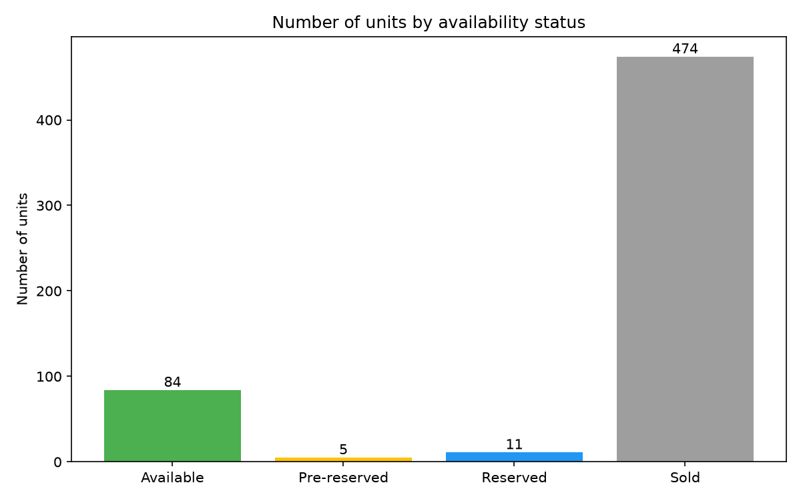
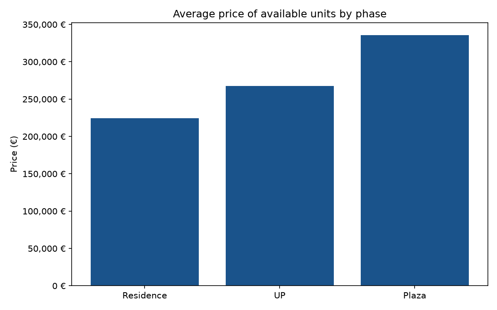
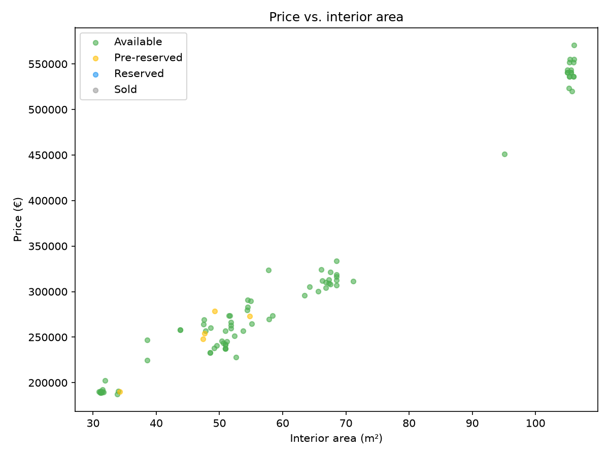
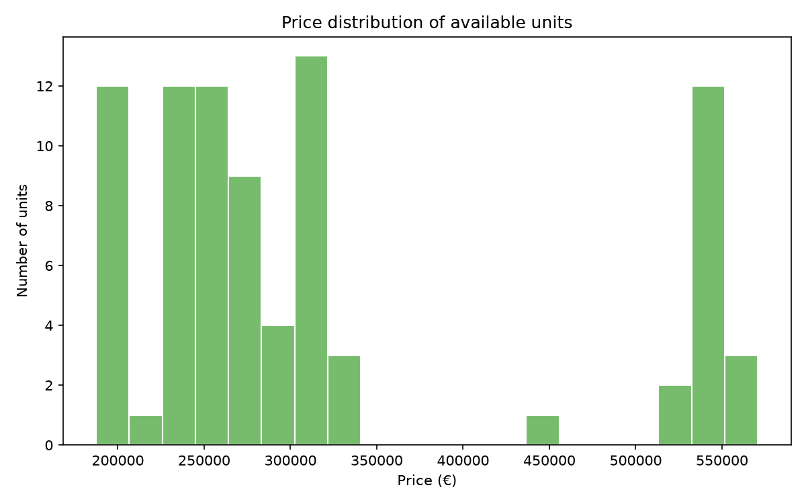

# Real Estate Listings Scraper — Showcase

*Data as of: September 22, 2026 (574 valid listings; live inventory that changes daily).*

An end-to-end Python data pipeline that monitors new-build flat listings on a Slovak real estate site: scrape via the site's own JSON API → validate → store in CSV + SQLite → report in Excel, static charts, and an interactive Streamlit dashboard → track price/status changes between runs.

**Source code is kept in a private repository** — happy to walk through it or share access on request (garajova.zuzana@gmail.com). This page shows the architecture and real evidence from actual runs.

```
                    ┌────────────────┐
  target site ─────►│    scraper     │  public JSON API, meaning-based parsing
                    └───────┬────────┘
                            │ listings.csv
        ┌───────────────────┼────────────────────┬─────────────────┐
        ▼                   ▼                    ▼                 ▼
┌───────────────┐  ┌──────────────────┐  ┌────────────────┐  ┌─────────────┐
│data validation│  │  SQLite storage  │  │ Excel report   │  │ PNG charts  │
│ (logging)     │  │   (SQL queries)  │  │ (live formulas)│  │(matplotlib) │
└───────────────┘  └──────────────────┘  └────────────────┘  └─────────────┘
        │                   │
        ▼                   ▼
┌──────────────┐   ┌────────────────────────────┐
│ Streamlit app│   │     change detection       │
│ (interactive)│   │ (day-over-day price diffs) │
└──────────────┘   └────────────────────────────┘
```

## Why scrape the API, not the page

Most scrapers reach for Selenium/Playwright by default. This one instead:

1. Opened the target page in a browser, went to **DevTools → Network → Fetch/XHR**, and reloaded — which revealed the site's own internal API endpoint returning JSON with an embedded HTML table fragment for each page of results.
2. Calls that endpoint directly with `requests`, parses the returned fragment with `BeautifulSoup`, and paginates through all pages.

**Why it matters:** faster, doesn't break when the site's visual design changes, and needs no browser automation stack — just `requests` + `BeautifulSoup`.

## Parsing strategy: extract by meaning, not by position

The site renders each listing row **twice** in the same table row — a compact mobile version and a full desktop version of the same data (toggled via CSS visibility classes). Rather than reading fixed column indexes (fragile — breaks silently if the site reorders or duplicates columns), the parser classifies each cell **by what it looks like**: a price contains `€`, a floor is a digit with a trailing dot, an area uses a Slovak decimal comma with no dot, a flat code is letters immediately followed by digits, and so on.

## Data quality engineering

- **Phantom listing detection:** the API keeps returning a placeholder/test record that never actually appears on the live site — no price, no area, and a zero room count. Caught by noticing the scraper — paginating by the API's own `total_pages` field — fetched **20 pages / 571 listings** while the live site visually showed only **19** — the gap pointed to a record that existed in the API's data but was never rendered publicly. Filtered out and logged on every run, not silently kept or dropped.

- **Dead-link avoidance:** for sold units whose detail page has been taken down, the URL is explicitly marked as a sentinel value instead of storing a link that would 404 — and validation asserts that sentinel appears if and only if the unit is marked sold.

- **Deduplication + independent re-verification:** listing IDs are tracked to avoid double-counting across paginated API calls, and a separate change-detection pass re-checks for duplicates rather than trusting the scraper's own logic.

- **Validation suite:** checks field completeness, value ranges, allowed status codes, and cross-field consistency — logging simultaneously to the terminal and a persistent log file.

## Evidence from real runs

This has been run repeatedly against the live site over six weeks (Aug 12 → Sept 22, 2026), not just once for a demo.

**Scraper run log** — four runs showing discovery, fix, and repeated verification. The Aug 12 run is the original version, before the phantom was discovered (found about a week later via a manual cross-check of API pagination vs. the live site); every run since the filter was added catches the same phantom automatically:

```
2026-08-12 13:23:45 INFO: Total pages to scrape: 19 (total listings reported: 569)
2026-08-12 13:24:28 INFO: Total listings scraped: 569
    (original run — before the phantom was discovered, no filter yet)
...
2026-08-19 13:38:54 WARNING: Skipping phantom listing (no price/area/rooms): flat_id=166561, nazov=O034
2026-08-23 20:01:37 WARNING: Skipping phantom listing (no price/area/rooms): flat_id=166561, nazov=O034
2026-09-22 06:20:16 WARNING: Skipping phantom listing (no price/area/rooms): flat_id=166561, nazov=O034
2026-09-22 06:20:18 INFO: Total listings scraped: 574
```

**Data validation log** — every check passing on a real 574-row run:

```
=== FIELD COMPLETENESS ===
  flat_id: filled 574/574 (100.0%), missing 0
  plocha_interier_m2: filled 574/574 (100.0%), missing 0
  stav_kod: filled 574/574 (100.0%), missing 0
=== SANITY RANGE CHECKS ===
  cena_eur: OK - all values within range 10,000-2,000,000
  plocha_spolu_m2: OK - all values within range 10-500
=== DUPLICATE CHECK ===
  flat_id: OK - no duplicates
=== URL / NA CHECK FOR SOLD UNITS ===
  url='NA' <-> stav_kod='sold': OK - exact match
```

**Real SQL query result** (SQLite, 574-row snapshot):

```sql
-- In the source data, stav_kod = 'V' denotes an available unit.
SELECT etapa, ROUND(AVG(cena_eur), 0) AS avg_price, COUNT(*) AS units
FROM byty
WHERE stav_kod = 'V'
GROUP BY etapa
ORDER BY avg_price;
```

| Construction phase | Avg. price (€) | Available units |
|---|---|---|
| Residence | 224 652 | 3 |
| UP | 267 692 | 16 |
| Plaza | 335 796 | 65 |

**Charts generated from real data** (not mockups):



Out of 574 total units tracked, 474 are already sold — this project has real signal on a fast-moving inventory, not a static demo dataset.





Price scales close to linearly with interior area, with a visible premium cluster above 100 m² in the Plaza phase.



## Sample data

*(8 of 574 tracked listings)*

| Flat code | Building | Floor | Orientation | Rooms | Interior (m²) | Exterior (m²) | Total (m²) | Price (€) | €/m² interior | Year | Status |
|---|---|---|---|---|---|---|---|---|---|---|---|
| P14 | P | 1. | Z | 1.5 | 38.55 | 27.43 | 65.98 | 224 427 | 5 821.71 | 2026 | Available |
| P16 | P | 1. | V | 1.5 | 38.55 | 47.11 | 85.66 | 246 944 | 6 405.81 | 2026 | Available |
| R13 | R | 1. | J | 1 | 31.91 | 30.48 | 62.39 | 202 584 | 6 348.61 | 2026 | Available |
| S102 | S | 1. | S | 2 | 48.53 | 46.10 | 48.53 | 232 799 | 4 797.01 | 2027 | Available |
| S103 | S | 1. | SZ | 3 | 68.55 | 63.71 | 68.55 | 307 209 | 4 481.53 | 2027 | Available |
| S105 | S | 1. | J | 2 | 43.78 | 18.23 | 62.01 | 258 026 | 5 893.70 | 2027 | Available |
| S109 | S | 1. | J | 2 | 43.78 | 18.23 | 62.01 | 258 026 | 5 893.70 | 2027 | Available |
| S115 | S | 1. | S | 2 | 48.53 | 46.10 | 48.53 | 232 799 | 4 797.01 | 2027 | Available |

## Tech stack

`Python` · `requests` · `BeautifulSoup4` · `pandas` · `sqlite3` · `openpyxl` · `matplotlib` · `Streamlit` · `logging`

## What's in the private repository

- `scraper.py` — the core scraper described above
- `data_validation.py` — the validation suite (logging to file + console)
- `save_to_sqlite.py` — CSV → SQLite, with sample SQL queries
- `create_excel_report.py` — a 2-sheet Excel report with live formulas and native charts
- `create_charts.py` — the matplotlib charts shown above
- `streamlit_app.py` — an interactive filterable dashboard ([live demo coming soon])
- `change_detection.py` — day-over-day diffing with dated snapshots and change reports

Get in touch if you'd like a walkthrough.
